# Estudo Dirigido 01 — Computação Visual

**Disciplina:** Computação Gráfica
**Atividade:** AC1 — Diferenças e características das áreas da Computação Visual
**Aluno(a):** _____________________
**Data:** _____________________

---

## 1. Objetivo e critério de comparação

O objetivo é demonstrar as diferenças entre as quatro áreas da Computação
Visual: **Síntese de Imagens**, **Processamento de Imagens**, **Visão
Computacional** e **Visualização Computacional**.

O critério que organiza a comparação inteira é o **par entrada → saída**.
Cada área se define por aquilo que consome e aquilo que produz, e não pelo
assunto de que trata. Duas áreas podem processar a mesma fotografia e ainda
assim serem disciplinas distintas, porque uma devolve outra fotografia e a
outra devolve uma lista de objetos.

| Área | Entrada | Saída | Pergunta que responde |
|---|---|---|---|
| Síntese de imagens | descrição de cena 3D (modelo) | imagem | "Como esta cena apareceria numa câmera?" |
| Processamento de imagens | imagem | imagem (ou medida) | "Como melhorar/transformar esta imagem?" |
| Visão computacional | imagem | descrição simbólica / modelo | "O que existe nesta imagem?" |
| Visualização computacional | dados abstratos | imagem | "Que forma dar a dados que não têm forma?" |

Dois pares merecem destaque:

- **Síntese e Visão são problemas inversos.** A síntese vai do modelo 3D para
  a imagem; a visão tenta recuperar o modelo a partir da imagem. A síntese é
  um problema bem-posto (dada a cena, existe uma imagem correta); a visão é
  mal-posto (infinitas cenas 3D produzem a mesma projeção 2D).
- **Síntese e Visualização compartilham a saída, mas divergem na entrada.**
  A computação gráfica parte de uma geometria que já existe. A visualização
  precisa *inventar* uma geometria e uma aparência para dados que não as
  possuem — temperatura, concentração, votos, expressão gênica.

Para tornar essas relações verificáveis, as quatro implementações deste
trabalho são **encadeadas**: o render produzido na Área 1 é a entrada da
Área 2 e da Área 3, e a Área 3 tenta reconstruir os parâmetros da cena que
a Área 1 usou para gerar a imagem.

```
   Área 1                Área 2                    Área 3
 cena 3D  ──render──►  imagem  ──filtros──►  imagem restaurada
                          │
                          └────────────────►  descrição da cena
                                              (compara com o gabarito
                                               da Área 1: erro em pixels)

   Área 4
 campo escalar 3D ──mapeamento visual──►  imagem
```

---

## 2. Área 1 — Síntese de Imagens (Computação Gráfica)

### 2.1 Aplicação escolhida

**Ray tracing de Monte Carlo (path tracing).** É o algoritmo por trás de
renderizadores de produção como Cycles (Blender), Arnold e RenderMan, e é
a técnica que a indústria de cinema adotou como padrão. Foi escolhido
porque explicita a natureza da área: o programa recebe **números que
descrevem uma cena** e devolve **pixels**.

### 2.2 Aspectos específicos da área

1. **A entrada é um modelo, não uma imagem.** A cena é uma lista de esferas
   com centro, raio, albedo e tipo de material, mais os parâmetros da
   câmera. Nenhum pixel existe antes da execução.
2. **Modelo de câmera pinhole.** Cada pixel gera um raio primário a partir
   do centro de projeção, atravessando o plano de imagem (viewport).
3. **Modelos de material (BRDF).** Implementados dois: lambertiano (difuso,
   espalha em direção aleatória em torno da normal) e metálico (reflexão
   especular com rugosidade `fuzz`).
4. **Iluminação global por Monte Carlo.** A cor de um pixel é uma *integral*
   sobre todos os caminhos de luz possíveis, estimada por amostragem
   aleatória. Por isso o resultado com poucas amostras é ruidoso.
5. **Textura procedural.** O chão usa um padrão xadrez avaliado no ponto de
   interseção: o albedo passa a ser função da posição na superfície.
6. **Anti-aliasing por supersampling.** O raio é lançado com deslocamento
   aleatório dentro do pixel (jitter), o que suaviza as bordas.
7. **Correção gama.** A radiância calculada é linear; o valor gravado no
   arquivo passa por `x^(1/2.2)` para o espaço sRGB.

### 2.3 Execução e resultados

Código: `01_sintese_imagens/raytracer.py` (implementação própria, vetorizada
com NumPy, sem GPU). Cena: 3 esferas + plano de chão xadrez, 480×270,
profundidade máxima de 8 ressaltos.

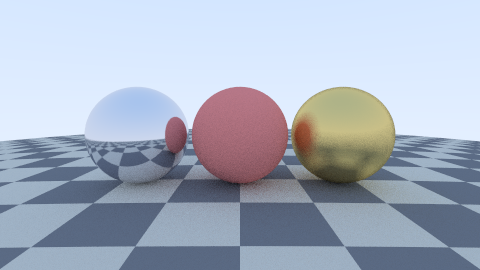

Convergência de Monte Carlo (medida em execução real):

| Amostras por pixel | Tempo | Custo relativo |
|---:|---:|---:|
| 1 | 0,17 s | 1,0× |
| 4 | 0,59 s | 3,5× |
| 16 | 2,35 s | 13,9× |
| 64 | 9,51 s | 56,4× |

> Os tempos variam conforme a máquina. Já as métricas de erro, PSNR e SSIM
> são determinísticas: todos os geradores aleatórios usam semente fixa.

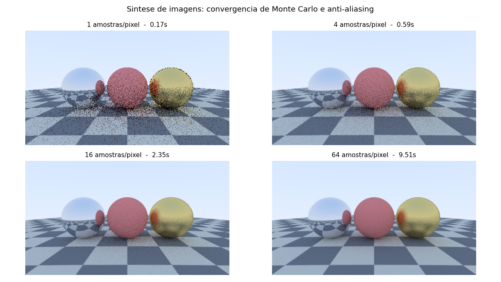

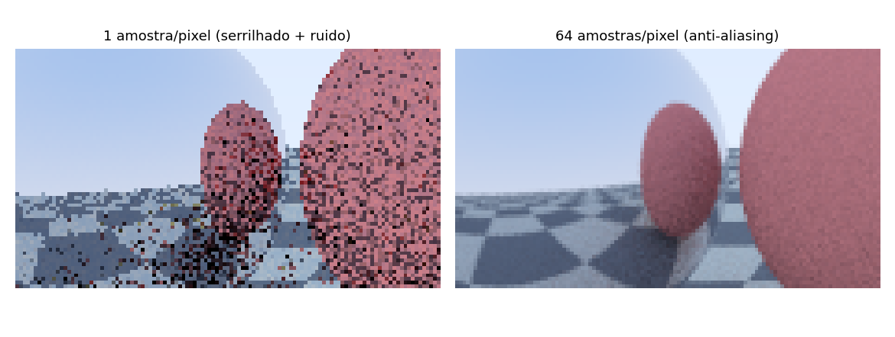

**Leitura do resultado.** O tempo cresce de forma aproximadamente linear com
o número de amostras, enquanto o ruído cai apenas com `1/√n`. Quadruplicar o
custo reduz o ruído pela metade. Esse é o compromisso central do rendering
por Monte Carlo e a razão de existirem tantas técnicas de redução de
variância (amostragem por importância, next event estimation, denoisers).

Note também a reflexão do xadrez na esfera metálica: ela não foi desenhada,
emergiu do modelo de material — os raios refletidos atingiram o chão.

### 2.4 Repositório público executado

**Ray Tracing in One Weekend** — Peter Shirley, Trevor David Black, Steve Hollasch
`https://github.com/RayTracing/raytracing.github.io`

```bash
git clone https://github.com/RayTracing/raytracing.github.io.git
cd raytracing.github.io
cmake -B build
cmake --build build
# O executável fica em build/ (confira o nome, geralmente inOneWeekend;
# no Windows pode estar em build/Debug/)
build/inOneWeekend > imagem.ppm
```

O arquivo `.ppm` abre no GIMP, no IrfanView ou pode ser convertido com
`magick imagem.ppm imagem.png` (ImageMagick). O código-fonte fica em
`src/InOneWeekend/` — vale abrir `camera.h` para ver a geração de raios e
`material.h` para as BRDFs, que são exatamente os aspectos 2 e 3 acima.

**Alternativa sem compilar:** Blender (`https://github.com/blender/blender`,
ou o instalador em blender.org). Renderize a cena padrão com o motor Cycles
em 8 e depois em 512 amostras e compare ruído e tempo — é o mesmo
experimento da tabela acima em um renderizador de produção.

---

## 3. Área 2 — Processamento Digital de Imagens

### 3.1 Aplicação escolhida

**Realce e restauração de imagens.** A imagem produzida na Área 1 é
degradada com ruído e depois recuperada, com avaliação objetiva por PSNR e
SSIM. É o núcleo de aplicações como restauração de fotografias, pré-
processamento de imagens médicas e limpeza de sensores em baixa luz.

### 3.2 Aspectos específicos da área

1. **Entrada e saída são imagens.** Não existe interpretação semântica: o
   programa nunca "sabe" que há esferas na cena. Ele opera sobre matrizes
   de intensidade.
2. **Operações pontuais e histograma.** Equalização global e CLAHE
   redistribuem intensidades sem mover um único pixel de lugar.
3. **Domínio espacial: convolução.** Núcleos 3×3 e 5×5 para suavização
   (média, gaussiano) e derivação (Sobel).
4. **Filtro não linear.** A mediana não é uma convolução e é o único filtro
   testado que trata bem ruído sal-e-pimenta.
5. **Domínio da frequência.** FFT 2D, espectro de magnitude, filtro
   passa-baixa ideal e gaussiano.
6. **Teorema da convolução verificado numericamente.**
7. **Morfologia matemática.** Erosão, dilatação, abertura e fechamento com
   elemento estruturante em disco.
8. **Métricas objetivas.** PSNR (fidelidade ponto a ponto) e SSIM
   (similaridade estrutural, mais próxima da percepção humana).

### 3.3 Execução e resultados

Código: `02_processamento_imagens/processamento.py`
(NumPy, SciPy, scikit-image).

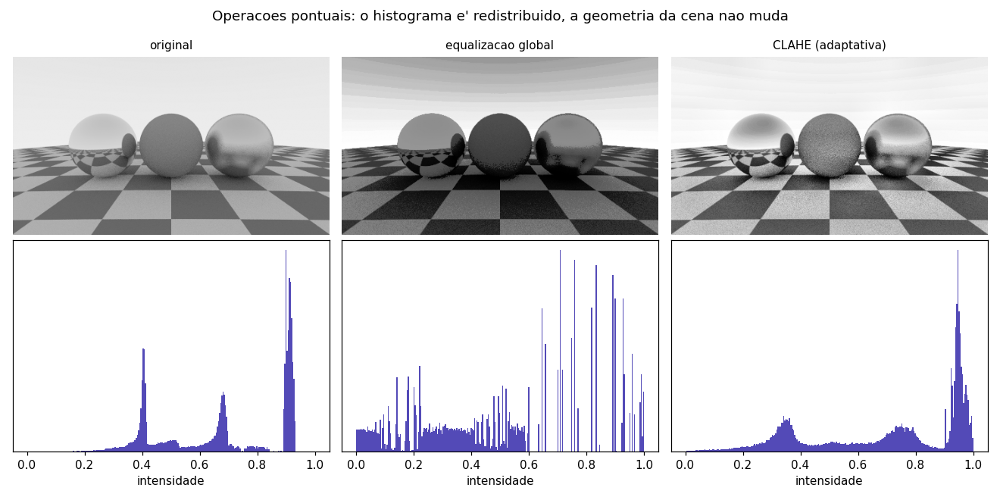

Resultados de restauração medidos (arquivo `saida/metricas.csv`):

| Ruído | Filtro | PSNR (dB) | SSIM |
|---|---|---:|---:|
| gaussiano | sem filtro | 22,33 | 0,286 |
| gaussiano | média 5×5 | 29,67 | 0,802 |
| gaussiano | gaussiano σ=1,5 | **30,36** | **0,830** |
| gaussiano | mediana 5×5 | 30,05 | 0,757 |
| sal e pimenta | sem filtro | 17,19 | 0,272 |
| sal e pimenta | média 5×5 | 27,23 | 0,656 |
| sal e pimenta | gaussiano σ=1,5 | 27,73 | 0,697 |
| sal e pimenta | **mediana 5×5** | **33,51** | **0,946** |

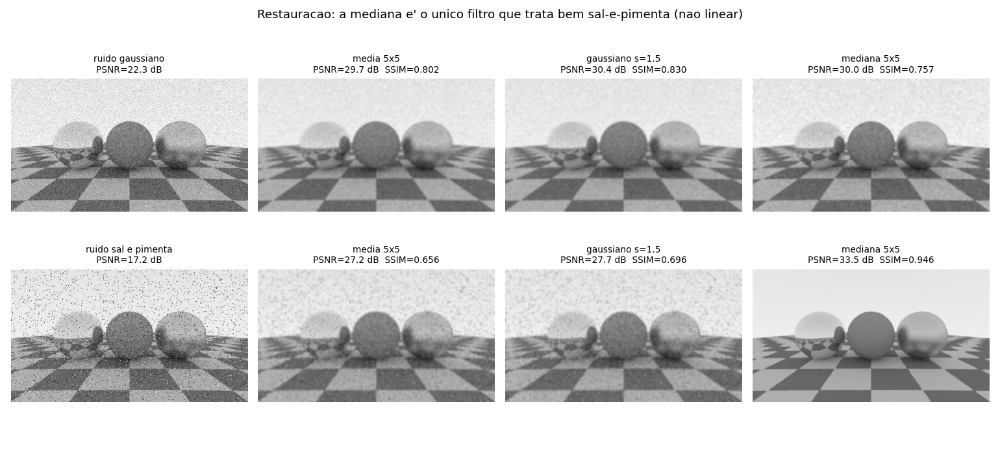

**Leitura do resultado.** Para ruído gaussiano, os filtros lineares vencem,
como prevê a teoria (o ruído é aditivo e de média zero). Para sal-e-pimenta,
a mediana ganha por quase 6 dB de PSNR e 0,25 de SSIM: os *outliers*
extremos destroem qualquer média, mas não afetam a estatística de ordem.
Esse é o argumento prático para filtros não lineares.

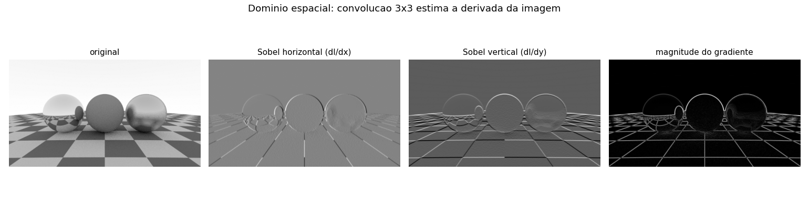

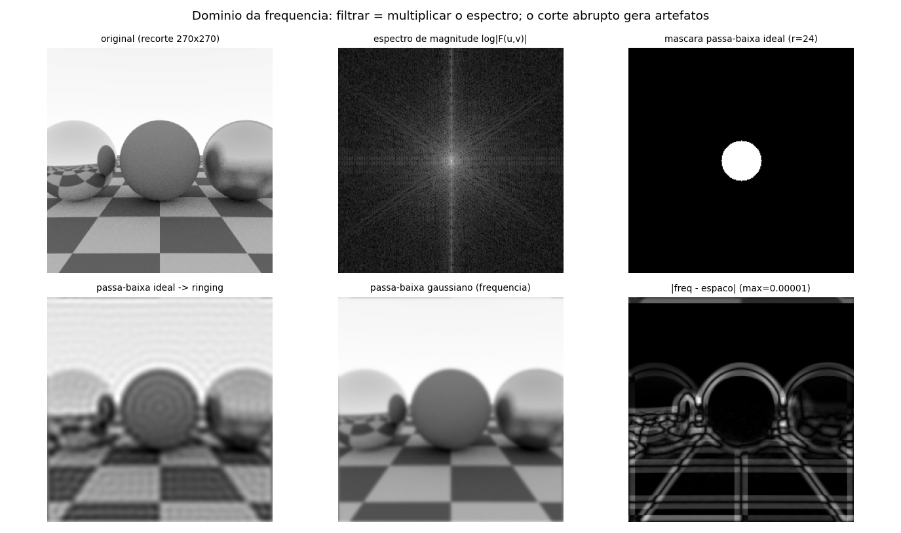

**Verificação do teorema da convolução.** Suavizar a imagem no domínio
espacial (gaussiana com σ = N/2πr, convolução circular) e multiplicar o
espectro por uma gaussiana no domínio da frequência produziram imagens cuja
diferença máxima foi de **0,00001** em escala [0,1]. São a mesma operação.

Note também o *ringing* no painel do passa-baixa ideal: o corte abrupto no
domínio da frequência equivale a convoluir com uma função sinc no espaço,
que oscila. Esse artefato é a razão de nunca se usar corte ideal na prática.

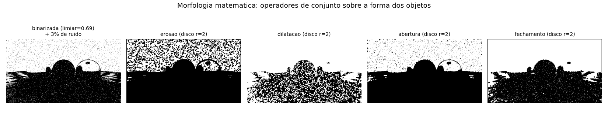

### 3.4 Repositório público executado

**scikit-image** — `https://github.com/scikit-image/scikit-image`

```bash
pip install scikit-image matplotlib
git clone https://github.com/scikit-image/scikit-image.git
cd scikit-image/doc/examples
# Os exemplos estão organizados por tema. Sugestões:
#   filters/     -> denoising, realce, detecção de bordas
#   segmentation/-> limiarização, watershed
python filters/plot_denoise.py
```

Cada script da galeria abre uma janela do matplotlib com o antes/depois.
A galeria também está publicada em `https://scikit-image.org/docs/stable/auto_examples/`.

**Alternativa com mais impacto visual:** Real-ESRGAN
(`https://github.com/xinntao/Real-ESRGAN`), super-resolução de imagens.

```bash
git clone https://github.com/xinntao/Real-ESRGAN.git
cd Real-ESRGAN
pip install basicsr facexlib gfpgan
pip install -r requirements.txt
python setup.py develop
python inference_realesrgan.py -n RealESRGAN_x4plus -i inputs -o results
```

Vale comentar no relatório que, embora use rede neural, continua sendo
processamento de imagens: entra imagem, sai imagem, sem descrição simbólica.

---

## 4. Área 3 — Visão Computacional (Visão Artificial)

### 4.1 Aplicação escolhida

**Recuperação da geometria da cena a partir da imagem.** Dois experimentos:
detecção dos objetos por transformada de Hough e estimação da transformação
geométrica entre duas vistas usando descritores locais e RANSAC.

O experimento foi montado para tornar a relação inversa **mensurável**: a
Área 1 salvou o gabarito (`cena_gabarito.json`) com o centro e o raio de
cada esfera projetados em pixels. O algoritmo de visão recebe **apenas a
imagem** e tenta reconstruir esses números; o gabarito só é usado no final
para calcular o erro.

### 4.2 Aspectos específicos da área

1. **A saída não é imagem, é descrição.** O produto final é o arquivo
   `descricao_da_cena.json`: rótulos, coordenadas e matrizes.
2. **Detecção por votação.** A transformada de Hough acumula votos no
   espaço de parâmetros (cx, cy, r) e escolhe os máximos.
3. **Avaliação contra ground truth.** Erro em pixels, e não inspeção visual.
4. **Características locais.** ORB (FAST para detecção + BRIEF orientado
   para descrição) produz vetores binários invariantes a rotação e escala.
5. **Casamento e o teste de razão de Lowe.** Descarta correspondências
   ambíguas comparando o melhor com o segundo melhor candidato.
6. **RANSAC.** Estima o modelo geométrico com robustez a correspondências
   erradas, que são inevitáveis.
7. **O papel da textura.** Região lisa não tem informação local suficiente
   para o casamento (problema da abertura) — ver resultado abaixo.

### 4.3 Execução e resultados

Código: `03_visao_computacional/visao.py` (OpenCV).

**Experimento A — recuperar os objetos da cena.**

| Objeto | Gabarito (cx, cy, r) | Estimado | Erro de centro | Erro de raio |
|---|---|---|---:|---:|
| esfera metálica | (141, 135, 47) | (136, 140, 53) | 6,8 px | 5,7 px |
| esfera vermelha | (240, 135, 47) | (240, 136, 48) | 1,0 px | 0,7 px |
| esfera dourada | (339, 135, 47) | (344, 138, 51) | 5,5 px | 3,7 px |

Erro médio de centro: **4,43 px** — 0,92 % da largura da imagem.

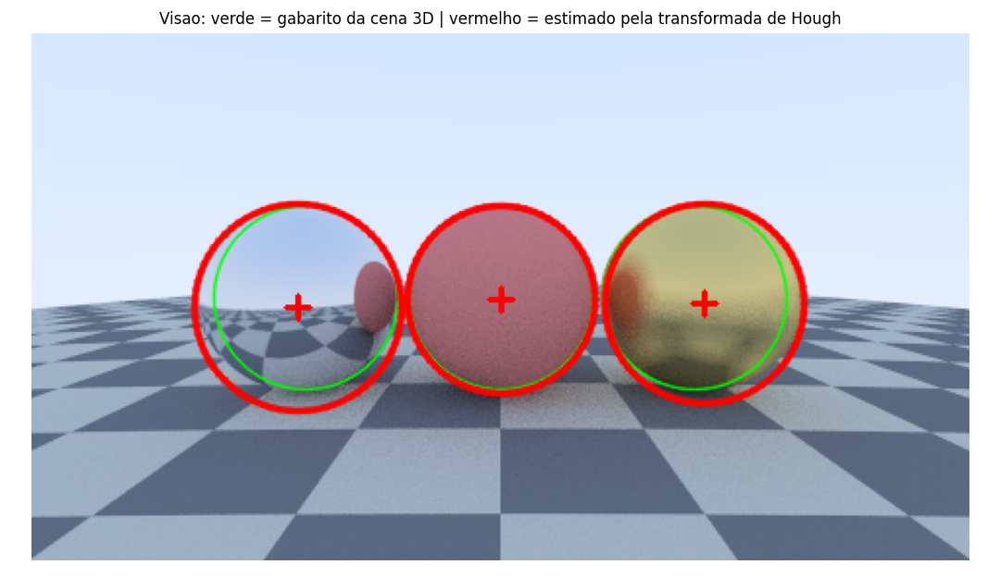

**Leitura do resultado.** A esfera lambertiana (vermelha) é recuperada quase
exatamente. As duas metálicas têm erro maior porque refletem o ambiente: a
borda do objeto fica ambígua para o detector de bordas interno, já que parte
do que aparece "dentro" da esfera é, na verdade, o chão refletido. Isso
ilustra por que a visão é mal-posta — a aparência não determina o objeto.

**Experimento B — geometria entre duas vistas.** A imagem foi transformada
por uma rotação de 17°, escala 0,82 e translação conhecidas; o algoritmo
tenta redescobrir essa transformação.

| Métrica | Valor |
|---|---:|
| Pontos de interesse (vista 1 / vista 2) | 756 / 671 |
| Casamentos após o teste de Lowe | 460 |
| Inliers do RANSAC | 430 (93 %) |
| Erro médio de reprojeção dos cantos | **1,11 px** |

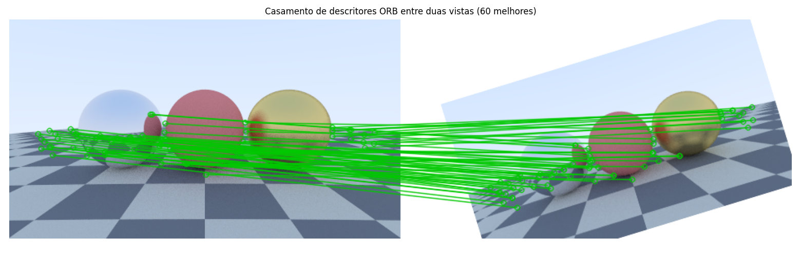

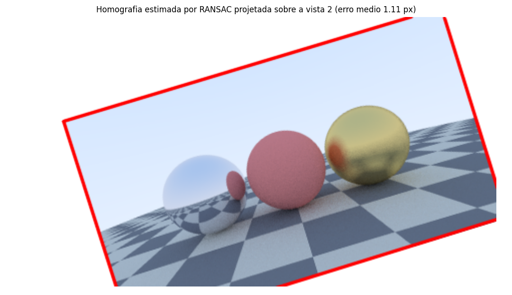

**Leitura do resultado.** Em uma versão anterior da cena, sem o chão
xadrez, o ORB encontrou apenas **85** pontos e o erro de reprojeção foi de
**36,7 px**. Com a textura procedural, foram **756** pontos e **1,11 px** —
uma melhora de mais de 30× no erro. É a demonstração prática de que
características locais precisam de variação local de intensidade:
superfícies lisas simplesmente não carregam a informação necessária.

Compare o formato da saída desta área com o da anterior. A Área 2 devolveu
uma matriz de pixels; esta devolve `{"objeto": "esfera_vermelha",
"cx": 240.0, "cy": 136.0, "raio_px": 48.0}`. Essa é a diferença essencial.

### 4.4 Repositório público executado

**Ultralytics YOLO** — `https://github.com/ultralytics/ultralytics`

```bash
pip install ultralytics
# Inferência em uma imagem de exemplo (baixa os pesos automaticamente)
yolo predict model=yolo11n.pt source='https://ultralytics.com/images/bus.jpg'
# Em modelos mais antigos, use model=yolov8n.pt
# Webcam:
yolo predict model=yolo11n.pt source=0
```

O resultado é gravado em `runs/detect/predict/`. Abra também o `.txt` de
rótulos: são classes e caixas delimitadoras, ou seja, **descrição**, não
imagem. Aspectos a comentar: classes do dataset COCO, limiar de confiança,
IoU e mAP, falsos positivos, e o custo de inferência.

**Alternativa conceitualmente mais forte (reconstrução 3D):** COLMAP
(`https://github.com/colmap/colmap`).

```bash
# Instalação: veja as instruções do repositório para o seu SO.
# Reconstrução automática a partir de uma pasta de fotos:
colmap automatic_reconstructor \
  --workspace_path ./projeto \
  --image_path ./projeto/images
colmap gui   # para visualizar a nuvem de pontos e as poses de câmera
```

O COLMAP executa literalmente o inverso do ray tracer da Área 1: recebe
imagens e devolve geometria 3D e parâmetros de câmera.

---

## 5. Área 4 — Visualização Computacional

### 5.1 Aplicação escolhida

**Visualização volumétrica de um campo escalar 3D**, o mesmo problema de um
exame de tomografia, de uma simulação de fluidos ou de um levantamento
sísmico. O dado usado é um campo de difusão gerado por simulação:
96 × 96 × 96 = 884.736 voxels de números em ponto flutuante, sem cor,
sem opacidade e sem geometria.

### 5.2 Aspectos específicos da área

1. **O dado não tem forma visual.** Diferente da Área 1, não existe uma
   imagem "correta". Existe um **mapeamento visual** mais ou menos
   defensável.
2. **Fatiamento ortogonal.** A representação mais elementar de um volume:
   cortes axial, coronal e sagital.
3. **Mapa de cores e percepção.** O mesmo corte com `gray`, `jet` e
   `viridis`, acompanhado do perfil de luminância de cada paleta.
4. **Função de transferência.** O mapeamento valor → (cor, opacidade) é a
   decisão de projeto central da área.
5. **Isosuperfícies com marching cubes.** O dado abstrato ganha geometria e,
   a partir daí, pode ser tratado por computação gráfica convencional.
6. **Volume rendering por composição alfa.** Ray casting front-to-back
   implementado explicitamente.

### 5.3 Execução e resultados

Código: `04_visualizacao_computacional/visualizacao.py`
(NumPy, SciPy, scikit-image, matplotlib).

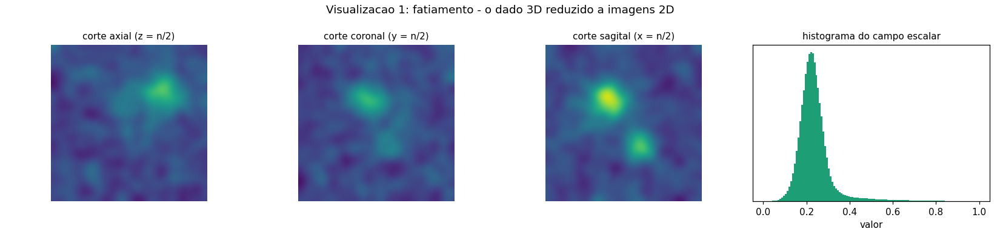

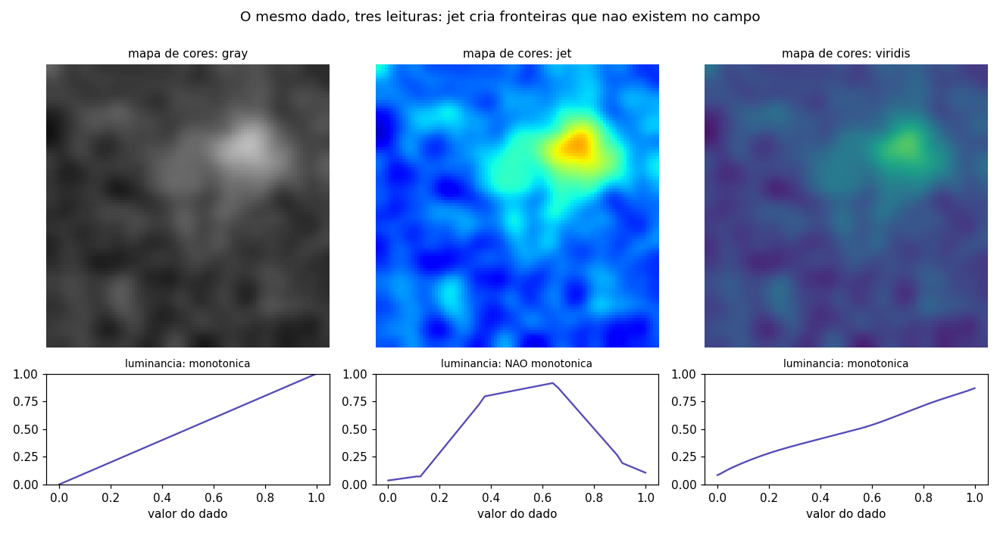

**Leitura do resultado.** O perfil de luminância mostra o problema do `jet`:
ele **não é monotônico**. Regiões de valores próximos podem receber cores de
brilho muito diferente, criando fronteiras visuais que não existem no dado,
e regiões de valores distantes podem receber brilho parecido, escondendo
diferenças reais. O `viridis` foi construído com luminância crescente
justamente para evitar isso, e continua legível em impressão em tons de
cinza e para daltônicos.

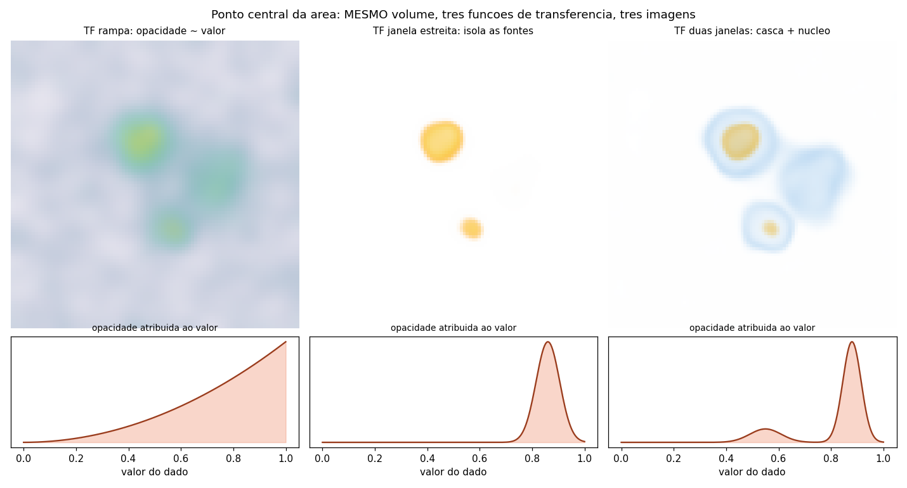

**Este é o resultado mais importante do trabalho para diferenciar a área.**
Os três painéis mostram o **mesmo volume**, renderizado com o **mesmo
algoritmo**, mudando apenas a função de transferência:

- *rampa* — opacidade cresce com o valor: tudo aparece e nada se destaca;
- *janela estreita* — só valores em torno de 0,86 recebem opacidade: as
  fontes ficam isoladas e o fundo desaparece;
- *duas janelas* — uma "casca" semitransparente azul mais um "núcleo"
  opaco dourado, revelando a estrutura interna.

Nenhuma das três é falsa e nenhuma é a única correta. Na síntese de
imagens, trocar o material muda a cena; aqui, trocar a função de
transferência muda apenas **o que se escolheu mostrar** de um dado que
permaneceu idêntico. É por isso que a visualização é tanto uma disciplina de
projeto quanto de computação, e por que honestidade no mapeamento é uma
questão ética na área.

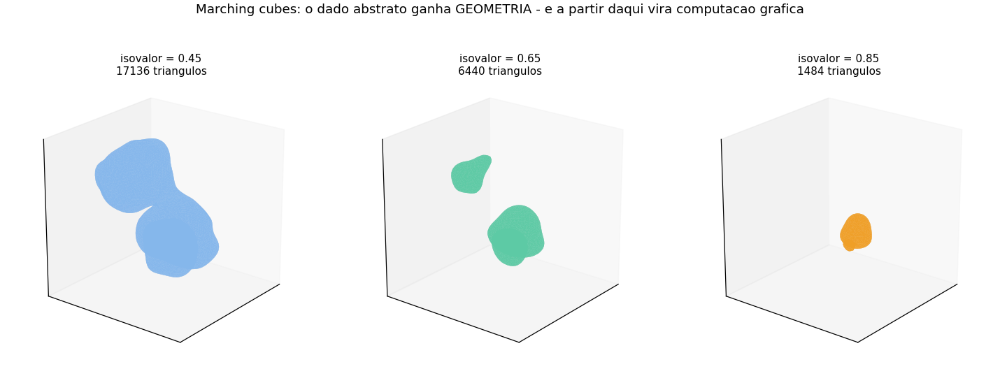

| Isovalor | Vértices | Triângulos |
|---:|---:|---:|
| 0,45 | 8.572 | 17.136 |
| 0,65 | 3.226 | 6.440 |
| 0,85 | 746 | 1.484 |

O isovalor também é uma escolha: abaixá-lo engloba o ruído de fundo,
elevá-lo esconde estrutura real. Uma vez extraída a malha, ela pode ser
enviada a um renderizador — o ponto em que a visualização passa a bastão
para a computação gráfica.

### 5.4 Repositório público executado

**3D Slicer** — `https://github.com/Slicer/Slicer` (download em slicer.org)

Passo a passo, sem precisar de dado próprio:

1. Instale e abra o 3D Slicer.
2. Módulo **Sample Data** → clique em **MRHead** (baixa um exame de
   ressonância de cabeça).
3. Módulo **Volume Rendering** → selecione o volume MRHead → marque o olho
   para ativar a renderização.
4. Em **Advanced → Volume Properties**, edite a função de transferência
   arrastando os pontos de opacidade. Repita o experimento da seção 5.3:
   isole a pele, depois o crânio, depois o tecido cerebral, **sem alterar o
   dado**. Salve uma captura de cada configuração.
5. Módulo **Segment Editor** → *Threshold* para extrair uma isosuperfície e
   exportá-la como modelo 3D (.stl/.obj).

**Alternativa (dados científicos gerais):** ParaView
(`https://github.com/Kitware/ParaView`, download em paraview.org).
Abra qualquer arquivo `.vti`/`.vtu` de exemplo, aplique os filtros
**Contour** (isosuperfície), **Slice** (corte) e **Volume Rendering**, e
compare os mapas de cores no *Color Map Editor* — ele já traz `viridis`
e avisa sobre paletas não perceptuais.

---

## 6. Quadro comparativo consolidado

| Critério | Síntese | Processamento | Visão | Visualização |
|---|---|---|---|---|
| Entrada | modelo 3D | imagem | imagem | dados abstratos |
| Saída | imagem | imagem | descrição | imagem |
| Problema | bem-posto | bem-posto | mal-posto | sem resposta única |
| Existe resultado "correto"? | sim, definido pela física | sim, dado o objetivo | sim, mas difícil de obter | não, existe mapeamento defensável |
| Métrica típica | tempo de render, variância | PSNR, SSIM | precisão, mAP, erro em px | legibilidade, fidelidade perceptual |
| Ferramenta usada aqui | ray tracer próprio (NumPy) | SciPy + scikit-image | OpenCV | matplotlib + marching cubes |
| Repositório público | Ray Tracing in One Weekend | scikit-image | Ultralytics YOLO | 3D Slicer / ParaView |
| Resultado obtido | 9,51 s a 64 spp | mediana: 33,51 dB em sal-e-pimenta | erro de 4,43 px na detecção | 3 imagens do mesmo dado |

---

## 7. Fronteiras e áreas híbridas

As quatro áreas são categorias de organização, não compartimentos estanques.
Os casos de fronteira são justamente onde a pesquisa recente se concentra:

- **NeRF e 3D Gaussian Splatting** recebem fotografias (visão) e produzem
  novas vistas renderizadas (síntese). A representação intermediária é
  aprendida, não modelada à mão.
- **Denoisers de render por rede neural** (OptiX, OIDN) são processamento de
  imagens aplicado à saída da síntese, e hoje são parte do pipeline de
  produção: renderiza-se com poucas amostras e limpa-se o ruído.
- **Diagnóstico por imagem médica** encadeia as quatro: reconstrução e realce
  do exame (processamento), segmentação e detecção de lesões (visão),
  renderização volumétrica para o médico (visualização) e planejamento
  cirúrgico em 3D (síntese).
- **Realidade aumentada** roda visão (rastreamento da pose da câmera) e
  síntese (desenho do objeto virtual) no mesmo quadro, em tempo real.
- **A câmera do celular** faz processamento (HDR, redução de ruído) e visão
  (detecção de rosto, segmentação para o modo retrato) simultaneamente.

---

## 8. Como reproduzir os resultados

```bash
pip install -r requirements.txt
python executar_tudo.py
```

O script executa as quatro etapas na ordem correta (a Área 2 e a Área 3
dependem da saída da Área 1) e grava `log_execucao.txt` com toda a saída de
console, que serve como evidência de execução. Tempo total medido:
**35,8 s** em uma máquina de 1 núcleo, sem GPU.

---

## 9. Referências

- GOMES, J.; VELHO, L. *Computação Gráfica: Imagem*. IMPA, 2008.
- GOMES, J.; VELHO, L. *Fundamentos da Computação Gráfica*. IMPA, 2003.
- SHIRLEY, P.; BLACK, T. D.; HOLLASCH, S. *Ray Tracing in One Weekend*.
  Disponível em `https://raytracing.github.io/`.
- PHARR, M.; JAKOB, W.; HUMPHREYS, G. *Physically Based Rendering: From
  Theory to Implementation*. 4. ed. MIT Press, 2023. `https://pbr-book.org/`
- GONZALEZ, R. C.; WOODS, R. E. *Digital Image Processing*. 4. ed.
  Pearson, 2018.
- SZELISKI, R. *Computer Vision: Algorithms and Applications*. 2. ed.
  Springer, 2022. `https://szeliski.org/Book/`
- MUNZNER, T. *Visualization Analysis and Design*. CRC Press, 2014.
- WARE, C. *Information Visualization: Perception for Design*. 4. ed.
  Morgan Kaufmann, 2020.
- LORENSEN, W. E.; CLINE, H. E. Marching cubes: a high resolution 3D
  surface construction algorithm. *SIGGRAPH Computer Graphics*, v. 21,
  n. 4, 1987.
