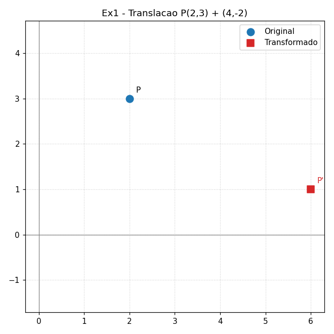
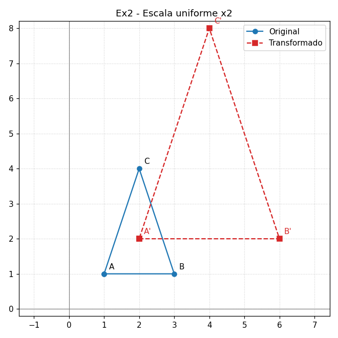
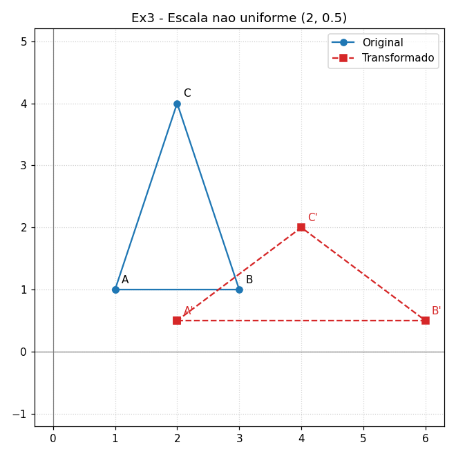
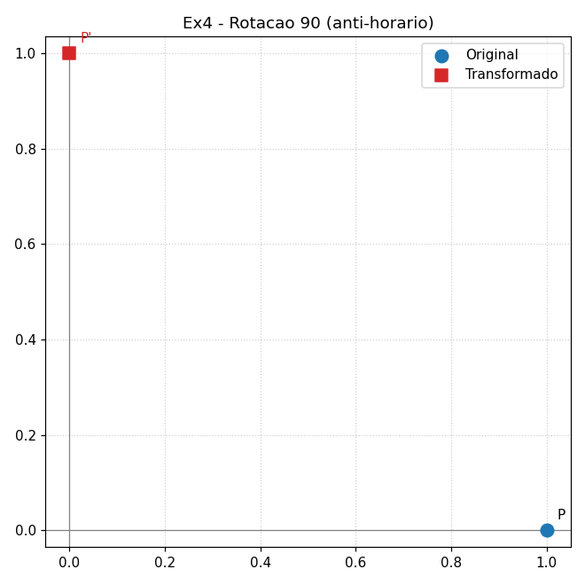
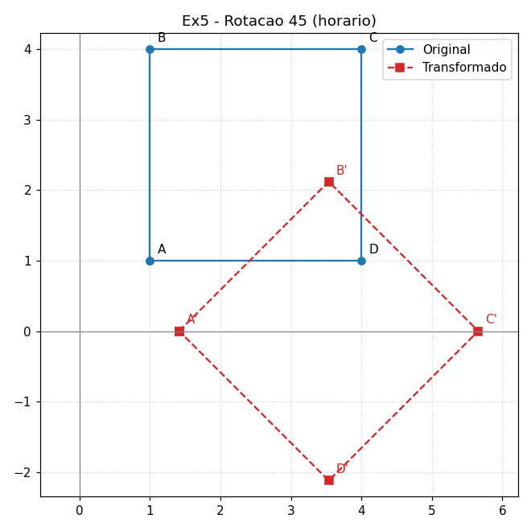
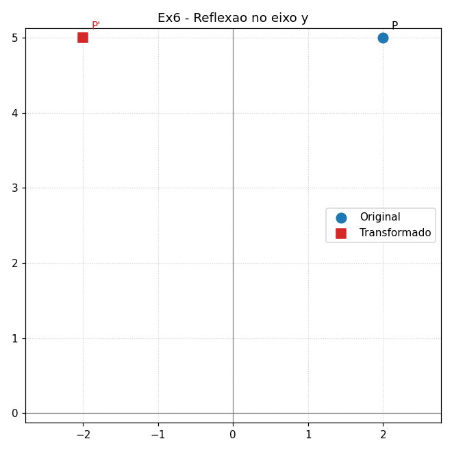
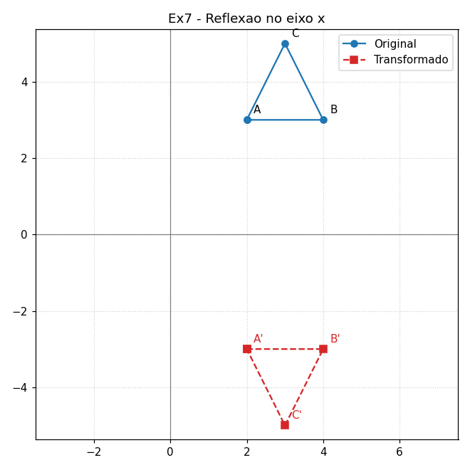
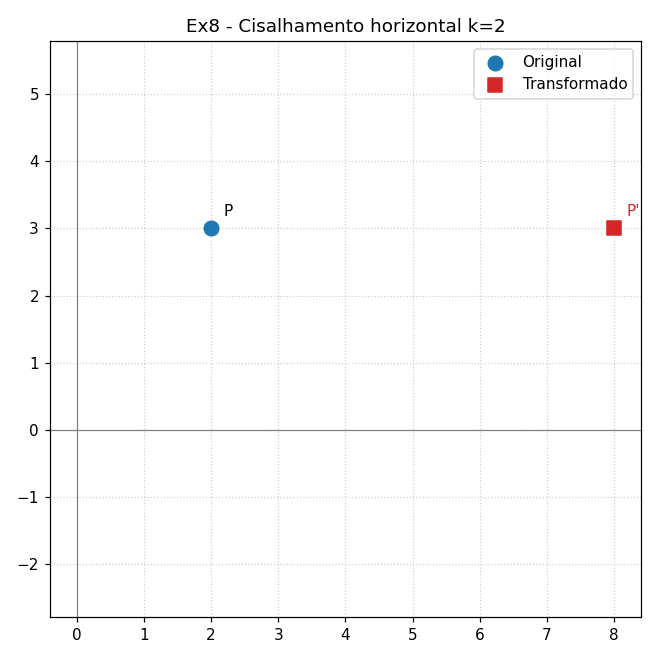
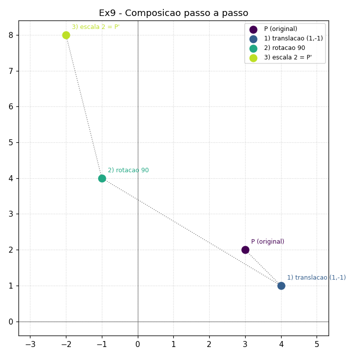
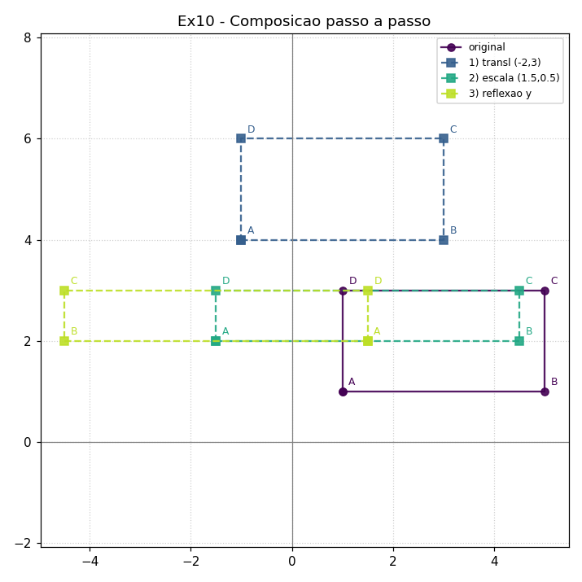

# Estudo Dirigido 02 — Transformações Geométricas 2D

**Disciplina:** Computação Gráfica
**Atividade:** AC2 — Transformações geométricas com Matplotlib
**Aluno(a):** _____________________
**Data:** _____________________

---

## 1. Objetivo e método

Resolver 10 exercícios de transformações geométricas no plano (translação,
escala, rotação, reflexão, cisalhamento e composições) exibindo, para cada um,
a **resposta numérica** e uma **visualização "antes/depois"** com Matplotlib.

Todas as transformações são implementadas em **coordenadas homogêneas**: cada
ponto vira `[x, y, 1]` e cada transformação é uma matriz `3×3`. Isso unifica a
translação (que não é linear em 2D) com as demais e faz de uma **composição**
apenas o produto das matrizes: `M = M3 @ M2 @ M1`.

Matrizes usadas (`transformacoes.py`):

| Transformação | Matriz |
|---|---|
| Translação `(tx,ty)` | `[[1,0,tx],[0,1,ty],[0,0,1]]` |
| Escala `(sx,sy)` | `[[sx,0,0],[0,sy,0],[0,0,1]]` |
| Rotação `θ` (anti-horário) | `[[cosθ,−sinθ,0],[sinθ,cosθ,0],[0,0,1]]` |
| Reflexão eixo x | escala `(1,−1)` |
| Reflexão eixo y | escala `(−1,1)` |
| Cisalhamento horizontal `k` | `[[1,k,0],[0,1,0],[0,0,1]]` |

Instalação: `pip install -r requirements.txt` (numpy + matplotlib).
Execução: `python AC2/transformacoes.py`.

---

## 2. Resoluções

### Exercício 1 — Translação simples
`P(2,3)` + vetor `(4,−2)`. → **P'(6, 1)**. Ambas as coordenadas mudam: `x+4`, `y−2`.

### Exercício 2 — Escala uniforme (fator 2)
Triângulo `A(1,1) B(3,1) C(2,4)` → **A(2,2) B(6,2) C(4,8)**.
A área cresce por `2² = 4`: escala linear afeta a área ao quadrado.

### Exercício 3 — Escala não uniforme (2 em x, 0,5 em y)
Mesmo triângulo → **A(2, 0.5) B(6, 0.5) C(4, 2)**. Estica na horizontal e
achata na vertical.

### Exercício 4 — Rotação 90° anti-horário na origem
`P(1,0)` → **P'(0, 1)** (o valor `6,12e−17` no console é zero numérico).

### Exercício 5 — Rotação 45° horário
Quadrado `A(1,1) B(1,4) C(4,4) D(4,1)` (rotação de −45° em torno da origem):
**A(1.41, 0) B(3.54, 2.12) C(5.66, 0) D(3.54, −2.12)**.

### Exercício 6 — Reflexão no eixo y
`P(2,5)` → **P'(−2, 5)** (só o sinal de x muda).

### Exercício 7 — Reflexão de triângulo no eixo x
`A(2,3) B(4,3) C(3,5)` → **A(2,−3) B(4,−3) C(3,−5)** (só o sinal de y muda).

### Exercício 8 — Cisalhamento horizontal (k = 2)
`P(2,3)`, `x' = x + k·y = 2 + 2·3` → **P'(8, 3)**.

### Exercício 9 — Composição em um ponto
`P(3,2)`: translação `(1,−1)` → `(4,1)`; rotação 90° anti-horário → `(−1,4)`;
escala uniforme 2 → **P'(−2, 8)**. Confirmado pela matriz única `M3@M2@M1`.

### Exercício 10 — Composição em uma figura
Retângulo `A(1,1) B(5,1) C(5,3) D(1,3)`: translação `(−2,3)`, escala `(1.5, 0.5)`,
reflexão no eixo y → **A(1.5, 2) B(−4.5, 2) C(−4.5, 3) D(1.5, 3)**.

---

## 3. Conclusão

A representação por matrizes homogêneas torna toda transformação — inclusive a
translação — um único produto de matrizes, e reduz composições ao produto
ordenado `M3 @ M2 @ M1`. A ordem importa: rotação seguida de translação difere
de translação seguida de rotação. As figuras "antes/depois" confirmam
visualmente cada resultado numérico.
