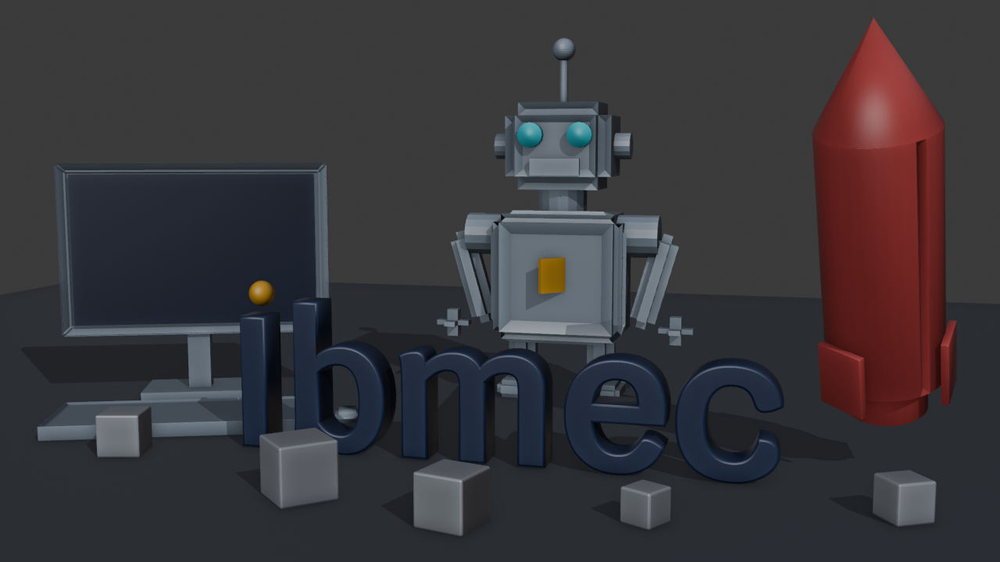
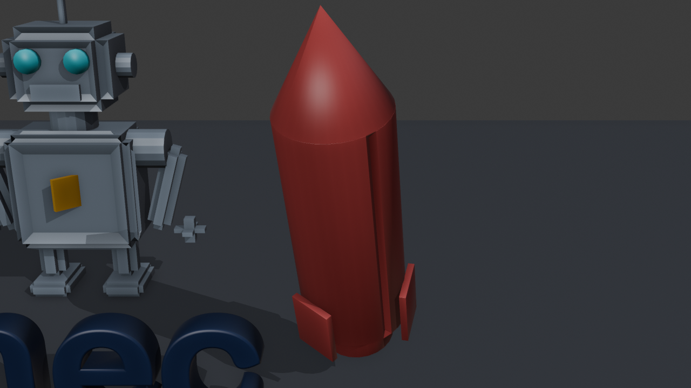

# AP1 — Relatório Técnico e Planejamento Visual: "Ibmec em 15 segundos"

**Aluno(a):** Michel Lutegar
**Matrícula:** 202208385192
**Curso / Turma:** Computação Gráfica (IBM0168 / 8001)
**Versão do Software:** Blender 4.5 LTS
**Nome do Arquivo .blend:** AP1_MichelLutegar.blend

---

## PARTE 1: RELATÓRIO CURTO

### 1. Título da Peça e Conceito Geral
* **Título da Peça:** "Ibmec: Construindo o Futuro"
* **Conceito Visual:** A composição estática apresenta a palavra **Ibmec** como
  elemento central, assentada no chão e ladeada por três objetos que traduzem os
  valores da marca. À esquerda, um **computador** (tecnologia e educação
  digital); ao centro-fundo, um **robô** (inteligência artificial, robótica e
  inovação); à direita, um **foguete** (futuridade e empreendedorismo). Blocos de
  "construção" espalhados na base reforçam a ideia de algo que está sendo
  **erguido/construído** — coerente com o tema "Construindo o Futuro".

  A leitura pretendida já num quadro estático é a de uma marca de tecnologia e
  negócios que se constrói peça a peça e se lança adiante. A paleta sóbria (azul-
  marinho da marca + cinza dos objetos + laranja de destaque) mantém o foco na
  palavra, enquanto os três objetos equilibram a composição pelas laterais e pelo
  fundo, criando profundidade.

### 2. Narrativa e Destaque da Marca Ibmec
* **Apresentação da Marca:** A palavra **Ibmec** é o elemento dominante do
  enquadramento principal — centralizada, em pé e tocando o chão, na fonte
  oficial **Krub**, em **azul-marinho** da marca, com o **ponto do "i" em
  laranja**. A integridade visual é preservada (fonte, cor e o pingo
  característicos), mantendo total legibilidade.
* **Ideia de Transformação:** Ao longo dos futuros 15 s, a cena sugere a
  **construção e revelação** da marca: os blocos se assentam, a palavra **Ibmec**
  se ergue ao centro e ganha destaque, e o foguete decola — encerrando com o
  hero shot da marca fixada.

### 3. Os Três Objetos Autorais
A cena contém exatamente três objetos autorais principais, modelados para
estruturar a composição:

1. **Objeto Autoral 1:** `Obj_Robo`
   * **Função na Cena:** representa **IA / robótica / inovação** — o "futuro".
     Fica atrás da palavra, como guardião da marca, dando profundidade e foco.
     Subpartes nomeadas: `Obj_Robo_Olhos` (ciano) e `Obj_Robo_Peito` (emblema).
   * **Modo de Construção:** modelado do zero, a partir de primitivas e
     modificadores.

2. **Objeto Autoral 2:** `Obj_Computador`
   * **Função na Cena:** representa **tecnologia e educação digital** — a
     ferramenta do conhecimento. Monitor + teclado + mouse à esquerda da palavra.
     Subpartes: `Obj_Computador_Tela` e `Obj_Computador_Mouse`.
   * **Modo de Construção:** modelado do zero, a partir de primitivas e
     modificadores.

3. **Objeto Autoral 3:** `Obj_Foguete`
   * **Função na Cena:** representa **futuridade e empreendedorismo** — o impulso,
     o lançamento da marca. Posicionado à direita, em diagonal ascendente.
   * **Modo de Construção:** modelado do zero, a partir de primitivas e
     modificadores.

> *Nota de Autoria:* os três objetos acima foram desenvolvidos de forma própria
> (composição de malhas). Não foram importados modelos externos; a única fonte
> externa é a tipografia **Krub** (fonte oficial da marca) aplicada ao texto.

### 4. Técnicas de Modelagem e Transformações Geométricas
* **Técnicas de Modelagem Utilizadas (além da escala básica):**
  **Extrusão** (texto e detalhes), **Inset** (tela do monitor, rosto/peito do
  robô, janela do foguete), **Bevel** (arredondamento geral), **Loop Cut /
  subdivisão** (teclas do teclado, boca-grelha do robô), **Composição de malhas
  (Join)** e modificador **Array/Bevel**.
* **Transformações Geométricas:** aplicação intencional de **Translação**
  (posicionamento em camadas de profundidade), **Rotação** (computador em 3/4,
  foguete em diagonal de decolagem, braços do robô abertos) e **Escala**
  (proporção de cada objeto e da palavra), organizando o equilíbrio da cena 3D.

### 5. Organização Técnica da Cena
* **Estrutura de Coleções:** todos os elementos estão agrupados na coleção
  principal `AP1_Ibmec_Conceito`, com subcoleções **Palavra**, **Objetos** e
  **Auxiliares**.
* **Configuração da Câmera:** câmera principal `Cam_Principal` posicionada e
  enquadrada no elemento principal (constraint *Track To* mirando a palavra);
  pronta para receber a animação na AP2 (não animada nesta etapa).
* **Linha do Tempo Planejada:** duração configurada para **360 frames** a
  **24 fps** (totalizando 15 segundos), com 3 marcadores de storyboard.

### 6. Plano Resumido para a AP2 (Evolução da Cena)
* **Animação de Objetos e Câmera:** blocos se assentando, palavra **Ibmec**
  subindo ao destaque (com o pingo encaixando), foguete decolando; câmera com
  movimento de aproximação (*push-in*), interpolação com *ease in/out*.
* **Iluminação e Materiais:** luz-chave + preenchimento + contraluz (rim);
  materiais com as cores oficiais da marca, verniz na palavra e textura
  procedural no chão; fundo/ambiente de apoio.
* **Renderização Final:** **Eevee** (e **Cycles** para a capa) e **exportação do
  vídeo** de ~15 s.

---

## PARTE 2: STORYBOARD (PLANEJAMENTO AUDIOVISUAL DE 15 SEGUNDOS)

A storyboard divide a animação planejada para a AP2 em **três momentos
principais**, cobrindo o intervalo total de **360 frames a 24 fps**.

```
+-----------------------------------------------------------------------------------+
| QUADRO 1: INÍCIO E REVELAÇÃO (0s a 3s | Frames 1 a 72)                             |
+-----------------------------------------------------------------------------------+
|  [ ]     . blocos .      [ ]          (ver: enquadramento_principal.png)           |
|     [ ] espalhados  [ ]                                                            |
|  _______________________________                                                  |
|                                                                                   |
| • Ação/Movimento: a câmera inicia uma aproximação suave; os blocos de             |
|   "construção" começam a se assentar sobre a base.                                |
| • Elementos em Destaque: cenário se estabelece; a palavra Ibmec ainda não está    |
|   erguida (robô, computador e foguete já compõem as laterais/fundo).              |
| • Foco Visual: enquadramento amplo, estabelecendo o espaço e o tom.               |
+-----------------------------------------------------------------------------------+

+-----------------------------------------------------------------------------------+
| QUADRO 2: TRANSFORMAÇÃO E CLÍMAX (3s a 10s | Frames 73 a 240)                      |
+-----------------------------------------------------------------------------------+
|    🤖        I b m e c                                                              |
|  💻   ( sobe e ganha destaque )   🚀                                               |
|  _______________________________                                                  |
|                                                                                   |
| • Ação/Movimento: a palavra Ibmec se ergue ao centro e ganha destaque; o pingo    |
|   laranja do "i" encaixa; robô, computador e foguete reforçam a composição.       |
| • Elementos em Destaque: a MARCA torna-se o elemento dominante da cena.           |
| • Foco Visual: ponto de maior ênfase; câmera centraliza a marca (Track To).       |
+-----------------------------------------------------------------------------------+

+-----------------------------------------------------------------------------------+
| QUADRO 3: ENCERRAMENTO E FIXAÇÃO DA MARCA (10s a 15s | Frames 241 a 360)           |
+-----------------------------------------------------------------------------------+
|    🤖        I b m e c            🚀 ^                                              |
|  💻       [ === chão === ]         /                                               |
|  _______________________________/    (foguete decolando)                          |
|                                                                                   |
| • Ação/Movimento: o foguete decola em diagonal ascendente; a câmera desacelera    |
|   e trava no enquadramento principal.                                             |
| • Elementos em Destaque: a palavra Ibmec fica perfeitamente legível ao centro.    |
| • Foco Visual: encerramento estático e elegante da vinheta (hero shot).           |
+-----------------------------------------------------------------------------------+
```

Marcadores no `.blend`: `Inicio` (f1) · `Transformacao` (f73) · `Encerramento` (f241).

---

## Entregáveis (checklist de validação)
- **Arquivo .blend:** `AP1_MichelLutegar.blend` — salvo no Blender 4.5 LTS. ✅
- **Coleção/organização:** todos os objetos em `AP1_Ibmec_Conceito`
  (Palavra/Objetos/Auxiliares), com nomes coerentes. ✅
- **Imagem do enquadramento principal** (Workbench/solid):
  
- **Três capturas dos objetos autorais:**
  
  
  
- **Storyboard** com 3 momentos (Parte 2 acima). ✅
- **Timeline** 360 frames @ 24 fps. ✅
